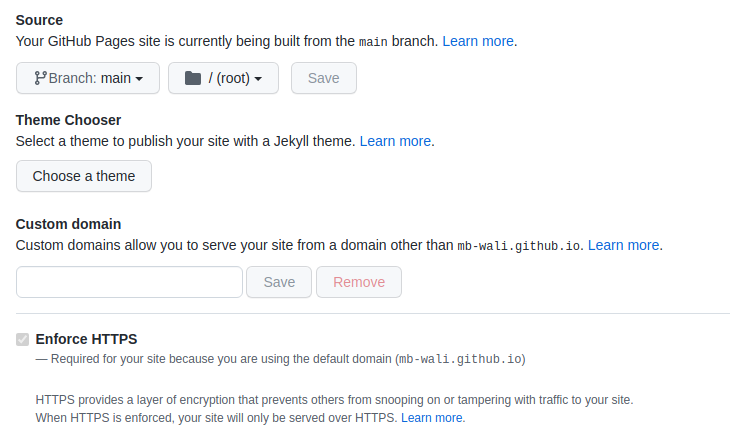

# Step-by-step guide

[ARTICLE SOURCE](https://medium.com/@mattiaperi/create-a-public-helm-chart-repository-with-github-pages-49b180dbb417)

*Please keep in mind that following the instruction below, your Helm charts repository will be public.*

Create a new repository on your Github account (i.e. “service-helm”):

## Create robots.txt
I’d like to avoid bot crawling on my repository, so I add the following robots.txt file:
```bash
echo -e “User-Agent: *\nDisallow: /” > robots.txt
```

## Create a helm chart from scratch (or copy your own)

### Create a helm chart

#### use cli to create a clean helm chart
```bash
# create
helm create service-helm

# check if your template is correct
helm template <nameofchart>
```

## Lint the chart
As a good habit, helm lint runs a series of tests to verify that
the chart is well-formed:

```bash
helm lint grader-service/*
```

## Create the Helm chart package
This command packages a chart into a versioned chart archive file. If a path is given, this will look at that path for a chart (which must contain a Chart.yaml file) and then package that directory.
Basicly it will create a zip file out of it.


```bash
helm package grader-service/*
```

## Create index.html
```bash
helm repo index --url https://mb-wali.github.io/service-helm/ .
```

## configure github pages of your repo
Go back to your browser, in the “settings” section of your git repository, scroll down to Github Pages section and configure it as follow:




**Now you can access with below links**
* [github pages link](https://mb-wali.github.io/service-helm/)
* [download package link](https://mb-wali.github.io/service-helm/grader-service-0.1.0.tgz)

## add to helm repo where you wish to deploy from
```bash
helm repo add service-helm https://mb-wali.github.io/service-helm/
```
